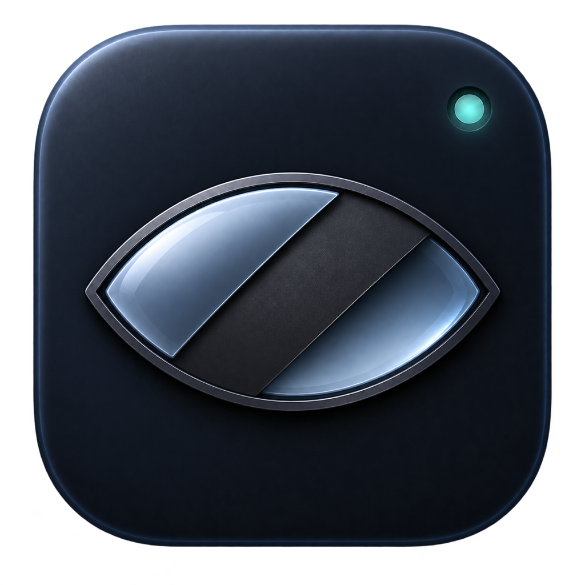
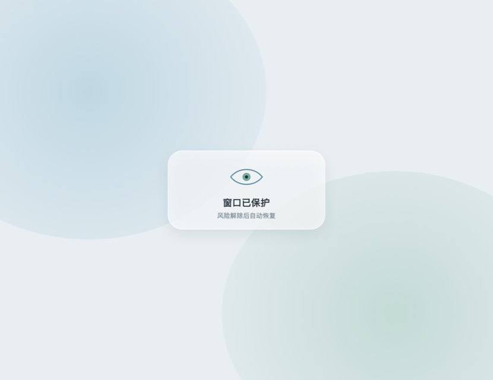
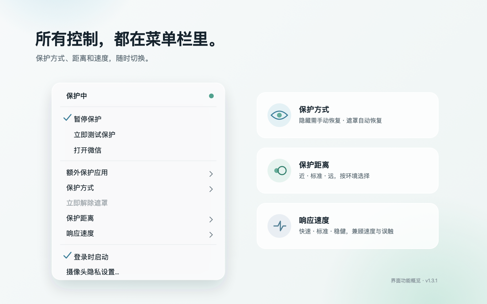

<div align="center">
  

  <h1>微信隐私守卫</h1>

  <p>
    一个原生 macOS 菜单栏工具。<br>
    有人靠近屏幕时，自动隐藏或遮住受保护的窗口。
  </p>

  <p>
    <a href="https://github.com/CarlosLiOxO/WeChatPrivacyGuard/releases/download/v1.4.0-rc1/WeChatPrivacyGuard-1.4.0-rc1.dmg"><strong>下载 1.4.0 RC1</strong></a>
    &nbsp;&nbsp;·&nbsp;&nbsp;
    <a href="https://github.com/CarlosLiOxO/WeChatPrivacyGuard/releases/download/v1.3.1/WeChatPrivacyGuard-1.3.1.dmg">稳定版 v1.3.1</a>
  </p>

  <p>本机处理&nbsp;&nbsp;·&nbsp;&nbsp;不存照片&nbsp;&nbsp;·&nbsp;&nbsp;不上传&nbsp;&nbsp;·&nbsp;&nbsp;macOS 13+</p>
</div>

<br>

<div align="center">
  
  <p><sub>真实毛玻璃保护状态。风险解除后，窗口自动恢复。</sub></p>
</div>

## 旁人靠近，窗口自动保护。

摄像头只负责判断画面中是否出现了可能看清屏幕的第二个人。满足风险条件后，微信和你选择的另一个 App 会立即进入保护；通知仍按原来的系统设置正常显示。

| 判断风险 | 两种保护 | 自由选择 |
| :---: | :---: | :---: |
| 综合第二张脸的大小与朝向，减少远处路人造成的误触发 | 隐藏窗口，或覆盖一层高遮蔽度毛玻璃 | 微信固定保护，并可额外选择一个已安装 App |

## 保护按你的环境调整

隐藏模式适合不希望窗口自动出现的场景，需要你手动恢复；隐私遮罩会在风险消失约 1 秒后自动解除。保护距离与响应速度各有三档，可在速度和误触之间找到适合自己的平衡。

<div align="center">
  
  <p><sub>界面功能概览：保护方式、额外应用、距离、速度与登录启动都集中在菜单栏。</sub></p>
</div>

## 三步开始

1. [下载微信隐私守卫 1.4.0 RC1](https://github.com/CarlosLiOxO/WeChatPrivacyGuard/releases/download/v1.4.0-rc1/WeChatPrivacyGuard-1.4.0-rc1.dmg)。
2. 打开 DMG，把“微信隐私守卫”拖入“应用程序”。
3. 首次启动时允许摄像头权限，然后从菜单栏选择保护方式、距离和速度。

1.4.0 RC1 是供提前体验的候选版本，当前仅支持 Apple 芯片 Mac。稳定使用可继续选择 v1.3.1。当前安装包使用本机临时签名，尚未经过 Apple Developer ID 公证；如果 macOS 阻止首次打开，请按 DMG 内的图文指南放行。

## 你的画面留在你的 Mac

- 人脸检测使用 Apple Vision，在本机内存中完成。
- 不录制、不截图，也不保存视频帧、人脸照片或裁剪图。
- 可选的本人识别只在主动录入后启用，面容特征保存在这台 Mac 的钥匙串中。
- 不联网识别人脸，不上传任何摄像头或面容数据。
- 没有受保护窗口可见、暂停保护或退出应用时，会停止使用摄像头。
- 摄像头工作时，macOS 会正常显示绿色隐私指示灯。

这是一套窥屏风险估算机制，不是视线追踪：它无法检测摄像头视野外的人，也不能证明旁人是否真的看清了屏幕。

## 当前能力

1.4.0 RC1 增加可选的本人识别与智能节能；v1.3.1 仍作为稳定版保留。

- 第二人风险判断：结合人脸大小与朝向，不把画面里所有远处人脸一概视为风险。
- 本人识别（可选）：录入本人后，在画面中出现其他人时触发保护。
- 保护距离：近、标准、远。
- 响应速度：快速、标准、稳健。
- 保护方式：隐藏窗口、隐私遮罩。
- 额外应用：扫描“应用程序”目录，允许选择一个已安装 App。
- 恢复策略：隐藏后手动恢复；遮罩在风险消失后自动恢复，也可点一次“暂时查看”临时查看该应用的全部窗口。
- 系统行为：登录后自动运行，只驻留菜单栏，不改变通知设置。

<details>
<summary><strong>从源码构建</strong></summary>

### 技术实现

项目使用 Objective-C、AppKit、AVFoundation、Vision、Core ML、Security、ServiceManagement、Core Graphics 和 QuartzCore。

### 构建环境

- macOS 13.0 或更高版本
- Xcode Command Line Tools
- Python 3 与 `reportlab`，用于生成 DMG 内的图文指南

```bash
python3 scripts/generate_quick_guide.py
./scripts/build_app.sh
```

脚本会在本地 `outputs/` 目录生成 App、ZIP 和 DMG。构建产物不会提交到源码仓库。

</details>

## 版权与许可

Copyright © 2026 李翰铭. All rights reserved.

本仓库公开可见，但不是开源软件。除查看和评估外，未经版权所有人事先书面授权，不得复制、修改、分发、部署、商用或制作衍生作品。完整条款见 [LICENSE](LICENSE)、[COPYRIGHT](COPYRIGHT) 和 [贡献说明](CONTRIBUTING.md)。

随项目分发的 MobileFaceNet 转换模型不属于李翰铭的原创产权，继续适用 Apache License 2.0；来源、修改和完整许可证见 [THIRD_PARTY_NOTICES.md](THIRD_PARTY_NOTICES.md)。

本项目与腾讯、微信或 Apple 没有隶属、授权或背书关系；相关商标归各自权利人所有。
